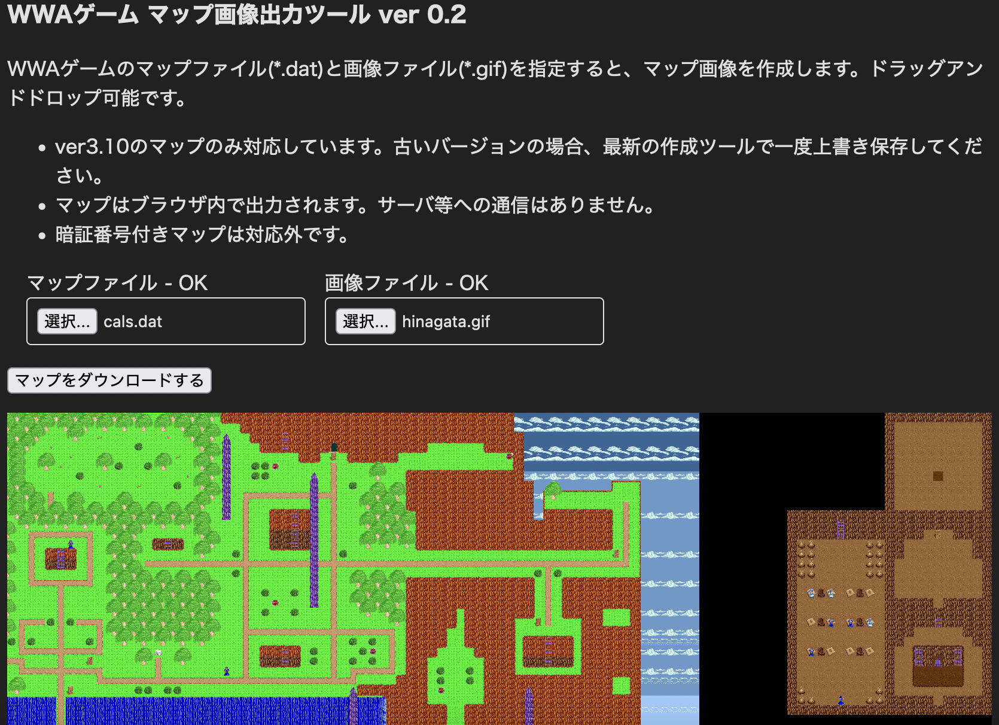

# wwamap-viewer
A tool to output map images for [World Wide Adventure(WWA) games](https://wwajp.com/top.html).



## Building the development environment
```bash
npm install
```

## Build for development
A browser will be launched on the local host to test the behavior. When you update the code, the browser will hot reload.

```bash
npm run start
```

## Build for production
```bash
npm run build
```

